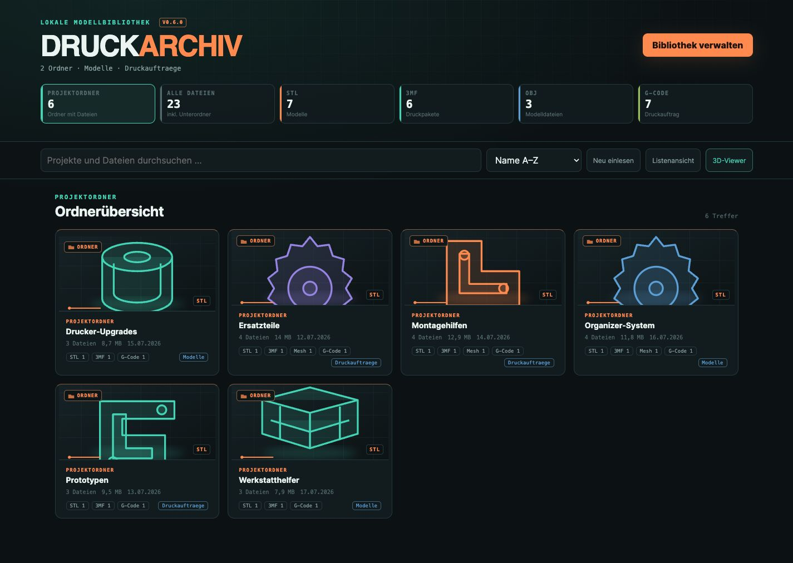
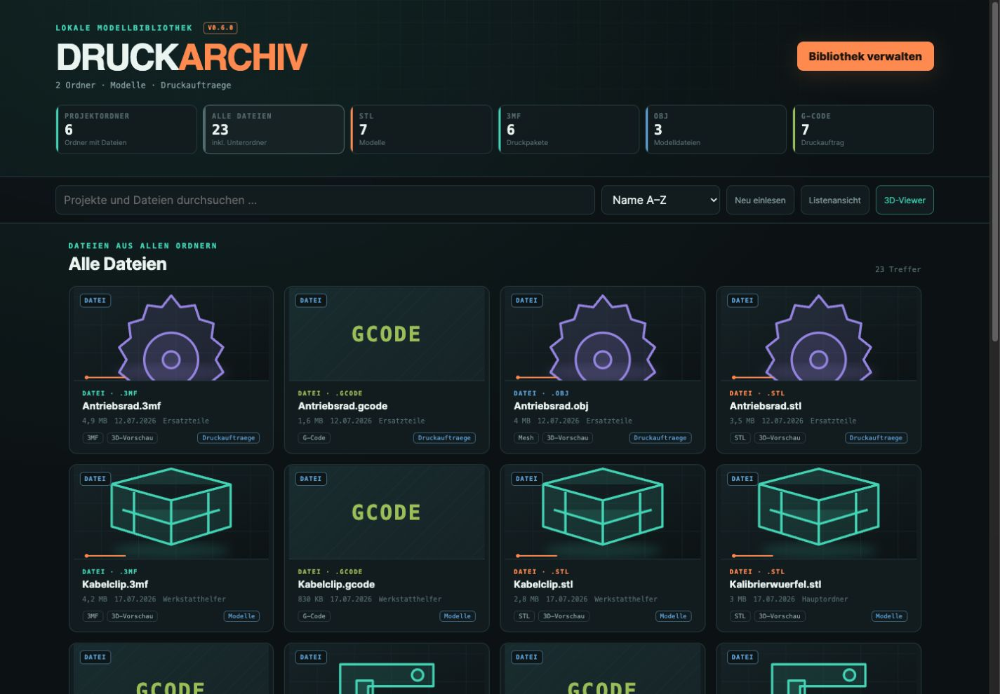
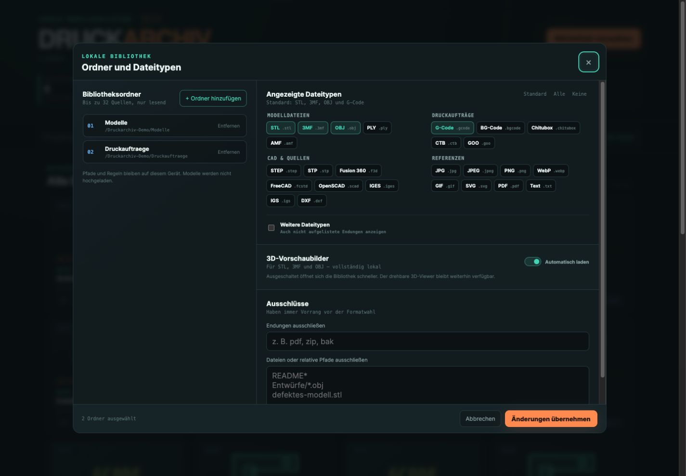

# Druckarchiv

**German translation below — [jump to German](#deutsch).**

Druckarchiv is a local desktop app for organizing, filtering, and viewing 3D printing files. Select one or more library folders and the app will scan their structure locally, presenting projects, individual files, and file types through interactive statistics.

**Current release: v0.8.9 — [download installers for macOS, Windows, and Linux](https://github.com/JaKeDEVEL/Druckarchiv/releases/latest).**

  

## Current features

- native desktop packages for macOS, Windows, and Linux; Linux downloads include `.deb` and portable `.AppImage` packages
- multiple library folders through the native folder picker on macOS, Windows, and Linux
- recursive, read-only library scanning without following symbolic links
- a simple default selection of STL, 3MF, OBJ, and G-code; additional mesh, CAD, and reference formats are opt-in
- exclusions by extension, file name, or relative path, including wildcard support
- dynamic KPI filters: only the format groups enabled in library settings appear alongside projects and files
- grid and list views with navigable subfolders and all files contained within them
- local file and folder favorites with one-click stars, a dedicated filter, and a “favorites first” sort order
- memory-efficient pagination with 25 or 50 entries per page, including inside open folders
- locally generated, deferred model thumbnails with visible loading progress; previews can be disabled in library settings
- an interactive STL, 3MF, and OBJ viewer in a focused preview window with rotation, zoom, pan, and a direct slicer action
- select print files in the main grid or list as well as inside project folders, then open them directly in OrcaSlicer, Bambu Studio, or PrusaSlicer; the most recently used slicer is stored locally
- German and English interfaces based on the system language, with manual selection and a locally stored preference
- light, dark, and system-based appearance modes with a locally stored preference
- signed in-app updates: Druckarchiv checks quietly at startup, shows release notes and download progress when a new version is available, and can also check manually from the app menu
- no telemetry, no user account, and no uploads
- Blender is **not required**

The app is deliberately kept separate from any real-world 3D printing library. This repository contains no models, file names, absolute user paths, thumbnails, or inventory data.

## Screenshots

All screenshots use synthetic demo data only and contain no private file names or paths.

### Project overview

### All files

### Manage library

## Preview strategy

The interactive viewer and card thumbnails render STL, 3MF, and OBJ files directly with Three.js and WebGL. Everything works offline and does not require Blender. Entries appear progressively so that KPI filters and view changes respond immediately. Thumbnails are generated only when a card approaches the visible area; duplicate requests are combined, no more than two models are processed in parallel, and exceptionally large models are skipped. Automatic previews can be disabled entirely under “Manage library.” A local Blender installation may be supported later as an optional studio-render provider without affecting the standard viewer.

Further information: [Privacy](PRIVACY.md), [Security](SECURITY.md).

> **One-time note for v0.8.8 users:** the updater is included for the first time in v0.8.9. Version 0.8.8 therefore still needs to be replaced manually once; subsequent updates can be installed directly inside Druckarchiv.

## Support the project

Druckarchiv is free to use. If the app helps you and you would like to support its continued development, you can buy me a coffee through PayPal:

[☕ Support Druckarchiv via PayPal](https://paypal.me/jkehl)

Every contribution helps with the continued development of Druckarchiv and the distribution of installers for macOS, Windows, and Linux.

## License

Druckarchiv may be used free of charge in its unmodified form for non-commercial purposes. It is deliberately **not open-source software**. Modifications, derivative works, commercial use, copying, or redistribution on other platforms are not permitted without prior written authorization. Links to the official repository or official downloads may be shared.

The complete terms are available in [LICENSE](LICENSE). Bundled libraries such as Tauri and Three.js retain their respective licenses; the restrictions of the Druckarchiv license do not alter the rights granted by those licenses.

---

## Deutsch

**Deutsche Übersetzung**

Druckarchiv ist eine lokale Desktop-App zum Ordnen, Filtern und Betrachten von 3D-Druck-Dateien. Man wählt einen oder mehrere Archivordner aus; die App liest deren Struktur lokal ein und zeigt Projekte, Einzeldateien und Dateitypen als direkt anklickbare Kennzahlen.

**Aktuelle Version: v0.8.9 — [Installer für macOS, Windows und Linux herunterladen](https://github.com/JaKeDEVEL/Druckarchiv/releases/latest).**

  

### Aktueller Stand

- native Desktop-Pakete für macOS, Windows und Linux; unter Linux stehen `.deb` und ein portables `.AppImage` bereit
- mehrere Bibliotheksordner über den nativen Ordnerdialog unter macOS, Windows und Linux
- rekursiver, schreibgeschützter Archivscan ohne Verfolgung symbolischer Links
- einfache Standardauswahl für STL, 3MF, OBJ und G-Code; weitere Mesh-, CAD- und Referenzformate sind Opt-in
- Ausschlüsse nach Endung, Dateiname oder relativem Pfad mit Platzhaltern
- dynamische KPI-Filter: Neben Projekten und Dateien erscheinen nur die in der Verwaltung aktivierten Formatgruppen
- Raster- und Listenansicht mit navigierbaren Unterordnern und allen darin enthaltenen Dateien
- lokale Datei- und Ordnerfavoriten mit direkt anklickbaren Sternen, eigenem Filter und der Sortierung „Favoriten zuerst“
- speicherschonende Pagination mit wahlweise 25 oder 50 Einträgen pro Seite – auch innerhalb geöffneter Ordner
- lokal und verzögert erzeugte Modell-Thumbnails mit sichtbarem Ladefortschritt; in der Verwaltung abschaltbar
- interaktiver STL-/3MF-/OBJ-Viewer in einem fokussierten Vorschaufenster mit Drehen, Zoomen, Verschieben und direkter Slicer-Aktion
- Druckdateien in der normalen Raster- oder Listenansicht sowie in Projektordnern auswählen und direkt in OrcaSlicer, Bambu Studio oder PrusaSlicer öffnen; der zuletzt verwendete Slicer bleibt lokal gespeichert
- deutsche und englische Oberfläche mit Systemsprache, manuellem Wechsel und lokal gespeichertem Sprachwunsch
- helle, dunkle oder am System ausgerichtete Darstellung mit lokal gespeicherter Auswahl
- signierte In-App-Updates: Druckarchiv prüft beim Start unaufdringlich auf neue Versionen, zeigt Neuerungen und Downloadfortschritt an und kann zusätzlich manuell im App-Menü prüfen
- keine Telemetrie, kein Benutzerkonto und kein Upload
- Blender ist **keine Voraussetzung**

Die App-Basis ist bewusst von einem realen Archiv getrennt. Dieses Repository enthält keine Modelle, Dateinamen, absoluten Benutzerpfade, Vorschaubilder oder Inventardaten.

### Einblick

Alle Aufnahmen verwenden ausschließlich synthetische Demodaten und enthalten keine privaten Dateinamen oder Pfade.

#### Projektübersicht

#### Alle Dateien

#### Bibliothek verwalten

### Vorschau-Strategie

Der drehbare Viewer und die Karten-Thumbnails rendern STL, 3MF und OBJ direkt mit Three.js/WebGL. Das ist offlinefähig und benötigt Blender nicht. Einträge erscheinen gestaffelt, damit KPI- und Ansichtswechsel sofort reagieren. Thumbnails werden erst erzeugt, wenn eine Karte in die Nähe des sichtbaren Bereichs kommt; identische Anfragen werden zusammengeführt, höchstens zwei Modelle parallel verarbeitet und sehr große Modelle übersprungen. In „Bibliothek verwalten“ können automatische Vorschaubilder vollständig abgeschaltet werden. Eine vorhandene Blender-Installation kann später optional als „Studio-Render“-Provider verwendet werden, ohne den Standardbetrieb zu beeinflussen.

Weitere Informationen: [Datenschutz](PRIVACY.md), [Sicherheit](SECURITY.md).

> **Einmaliger Hinweis für Nutzer von v0.8.8:** Der Updater ist erstmals in v0.8.9 enthalten. Version 0.8.8 muss deshalb noch einmal manuell ersetzt werden; alle folgenden Updates können direkt in Druckarchiv installiert werden.

### Projekt unterstützen

Druckarchiv ist kostenlos nutzbar. Wenn dir das Projekt hilft und du seine Weiterentwicklung unterstützen möchtest, kannst du mir über PayPal einen Kaffee spendieren:

[☕ Druckarchiv über PayPal unterstützen](https://paypal.me/jkehl)

Vielen Dank – jede Unterstützung hilft dabei, Druckarchiv weiterzuentwickeln und die Installer für macOS, Windows und Linux bereitzustellen.

### Lizenz

Druckarchiv ist kostenlos für unveränderte, nichtkommerzielle Nutzung. Es ist bewusst **keine Open-Source-Software**. Änderungen, abgeleitete Werke, kommerzielle Nutzung sowie das Kopieren oder erneute Veröffentlichen auf anderen Plattformen sind ohne vorherige schriftliche Erlaubnis nicht gestattet. Ein Link auf das offizielle Repository oder den offiziellen Download darf geteilt werden.

Die vollständigen Bedingungen stehen in der Datei [LICENSE](LICENSE). Eingebundene Bibliotheken wie Tauri und Three.js behalten ihre eigenen Lizenzen; die Einschränkungen der Druckarchiv-Lizenz ändern deren Rechte nicht.
